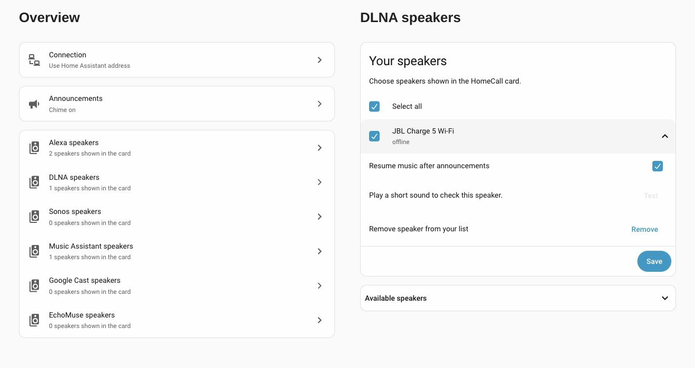
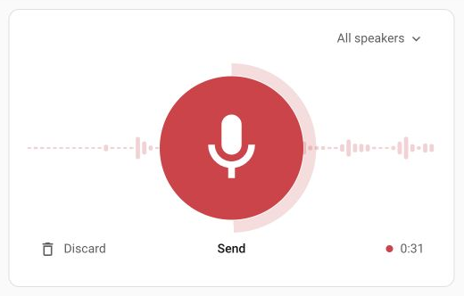
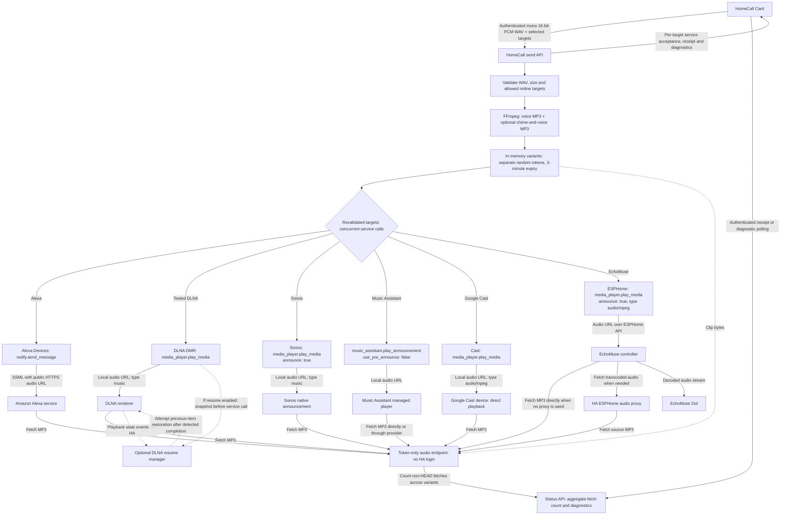

<p align="center">
<a href="https://github.com/thomasgregg/homecall/actions/workflows/ci.yml"></a>
<a href="LICENSE"></a>
<a href="https://hacs.xyz"></a>
</p>

**Record a message in Home Assistant. Hear your own voice on your speakers.**

HomeCall turns microphone recordings into short speaker announcements. It handles authenticated uploads, audio conversion, speakers shown in the card, and temporary delivery links. The separately installed [HomeCall Card](https://github.com/thomasgregg/homecall-card) provides the recording interface.

## Contents

- [Why HomeCall](#why-homecall)
- [Screenshots](#screenshots)
- [Speaker compatibility](#speaker-compatibility)
- [Which setup should I use?](#which-setup-should-i-use)
- [Before you start](#before-you-start)
- [Install](#install)
  - [HACS](#hacs)
  - [Manual installation](#manual)
- [Use](#use)
- [How it works](#how-it-works)
- [Documentation](#documentation)
- [Development](#development)

## Why HomeCall

- **Original voice:** send recorded audio rather than synthesized speech.
- **One room or many:** announce to selected Alexa, DLNA, Sonos, Music Assistant, Google Cast or EchoMuse speakers.
- **Native setup:** configure the public address and speakers shown in the card through Home Assistant.
- **Short-lived audio:** recordings are held in memory and delivery links expire after three minutes.
- **Clear feedback:** distinguish request acceptance from audio retrieval.
- **English and German:** setup and settings follow the Home Assistant language.

## Screenshots

Overview and expanded DLNA speaker options in the HomeCall integration.

[](docs/assets/ui-configuration.svg)

The separately installed [HomeCall Card](https://github.com/thomasgregg/homecall-card#screenshots) provides the recording interface, with a live waveform, countdown, and speaker picker.

[](https://github.com/thomasgregg/homecall-card#screenshots)

## Speaker compatibility

**HomeCall supports Alexa/Echo, compatible DLNA speakers, Music Assistant players, Google Cast devices, Sonos through Home Assistant’s Sonos integration, and EchoMuse Dots through ESPHome.** Use Alexa through Home Assistant’s Alexa Devices integration, DLNA through DLNA Digital Media Renderer, Sonos through the Sonos integration, and Music Assistant players through the Music Assistant integration. You can combine these platforms.

DLNA speakers must pass a sound test before they can appear in the card. JBL Charge 5 Wi-Fi has been checked for basic MP3 playback; other renderers require their own test. Optional **Resume music after announcements** can restore the interrupted media item and seek where supported. It does not restore playlists, queues, or streaming-service sessions. See [DLNA configuration and limitations](docs/configuration.md#dlna-speakers).

Ideas and contributions for other speaker platforms are welcome. [Open an issue](https://github.com/thomasgregg/homecall/issues) to discuss support.

🟢 **Verified** on the noted setup · 🟠 **Unverified or conditional** · 🔴 **Unsupported or failed**

<table>
  <tr>
    <th valign="top">Protocol / integration</th>
    <th valign="top">Announcement playback</th>
    <th valign="top">Optional announcement chime</th>
    <th valign="top">Music continuation</th>
    <th valign="top">Tested hardware / scope</th>
  </tr>
  <tr>
    <td valign="top">Alexa Devices</td>
    <td valign="top">🟢 Recorded voice announcements verified.</td>
    <td valign="top">🟢 Optional chime confirmed by the user on their Alexa setup.</td>
    <td valign="top">🟢 TuneIn radio resumed after Alexa SSML soundbank clips.</td>
    <td valign="top">Echo Show with Deutschlandfunk/TuneIn and soundbank clips. HomeCall-recording resume and other sources/models untested.</td>
  </tr>
  <tr>
    <td valign="top">DLNA</td>
    <td valign="top">🟢 MP3 playback verified; recorded voice verification pending.</td>
    <td valign="top">🟠 Combined chime and recording implemented; hardware verification pending.</td>
    <td valign="top">🟠 Optional current-item restoration and seek where supported; hardware restoration unverified. No playlist/session restoration.</td>
    <td valign="top">JBL Charge 5 Wi-Fi; other renderers require the sound test.</td>
  </tr>
  <tr>
    <td valign="top">Sonos</td>
    <td valign="top">🟠 Implemented using native <code>announce: true</code>; hardware playback unverified.</td>
    <td valign="top">🟠 Combined chime and recording implemented; hardware verification pending.</td>
    <td valign="top">🟠 Delegated to Sonos; not hardware-verified.</td>
    <td valign="top">Simulated discovery, setup and service-call tests only.</td>
  </tr>
  <tr>
    <td valign="top">Music Assistant</td>
    <td valign="top">🟢 Recorded voice with the optional chime confirmed by the user on their tested MA setup. Separate Sync Group playback reported on Reddit.</td>
    <td valign="top">🟢 Combined two-tone chime and recording confirmed by the user. MA's additional pre-announcement cue is disabled. Other providers/groups need verification.</td>
    <td valign="top">🟢 Ducking, continuation and volume restoration verified with MA-managed music through AirPlay 2. 🟠 A Reddit Sync Group report describes abrupt transitions and track-position behavior.</td>
    <td valign="top">Earlier ducking test: JBL Charge 5 Wi-Fi, AirPlay 2, MA 2.10.5. New combined-audio confirmation: user's MA setup. Reddit Sync Group models/protocols unspecified; full pause/resume unverified.</td>
  </tr>
  <tr>
    <td valign="top">EchoMuse (ESPHome)</td>
    <td valign="top">🟢 Recorded message playback and opening-cutoff fix confirmed by a Reddit user.</td>
    <td valign="top">🟠 Combined chime and recording implemented; hardware verification pending.</td>
    <td valign="top">🟠 Delegated to EchoMuse; hardware continuation unverified.</td>
    <td valign="top">User's EchoMuse Dots; installed firmware/controller versions unspecified. Music Assistant/SendSpin route not verified.</td>
  </tr>
  <tr>
    <td valign="top">Google Cast</td>
    <td valign="top">🟢 MP3 test playback verified on JBL; message playback reported by a Reddit Nest user.</td>
    <td valign="top">🟠 Skipped by default on direct Cast. Combined chime and recording available when the exception is disabled; hardware verification pending. Cast's native connection cue may still play.</td>
    <td valign="top">🔴 No automatic restoration. Phone-started YouTube Music remained stopped in our test.</td>
    <td valign="top">JBL Charge 5 Wi-Fi; Reddit Nest model unspecified. Specific Nest models and Cast groups need further tests.</td>
  </tr>
</table>

Results apply to the tested setup, not every model or firmware version. The optional announcement chime column refers to the new two-tone cue combined with a recording, not the standalone speaker sound test. The latest Music Assistant combined-audio test and Alexa optional-chime playback were confirmed by the user on 6 October 2026. The Alexa chime test does not establish music restoration. Reddit reports confirm limited EchoMuse and Nest message playback; they do not verify the new chime on those routes. DLNA requires a downloaded sound test and audible confirmation before adding a speaker. The other integrations offer optional sound tests.

User reports: [Music Assistant Sync Group](https://www.reddit.com/r/homeassistant/comments/1wycu0s/comment/pe579qq/), [EchoMuse cutoff fix](https://www.reddit.com/r/homeassistant/comments/1wycu0s/comment/pe7g2wf/), [Nest playback](https://www.reddit.com/r/homeassistant/comments/1wycu0s/comment/pe3tau1/).

The Alexa resume test used soundbank audio through the same Speak/SSML mechanism as HomeCall, with audible confirmation that the station resumed automatically. It did not test restoration after a HomeCall-hosted recorded MP3.

## Which setup should I use?

| Use case                                                                                | Recommended route                                                                                                               | What to expect                                                                                                                                                                                                                       |
| --------------------------------------------------------------------------------------- | ------------------------------------------------------------------------------------------------------------------------------- | ------------------------------------------------------------------------------------------------------------------------------------------------------------------------------------------------------------------------------------ |
| Streaming music or playlists should continue after messages                             | **Music Assistant**, with music started through MA and announcements sent to its MA entity.                                     | MA owns the queue and handles announcements. Our AirPlay 2 test passed; test your chosen provider. MA supports many [music services](https://www.music-assistant.io/music-providers/), subject to provider and account requirements. |
| Occasional messages on Nest or another Cast speaker, with music interruption acceptable | **Google Cast**.                                                                                                                | Simple local MP3 delivery, no MA server required. Current playback is replaced and does not automatically return. Nest hardware still needs testing.                                                                                 |
| Keep casting YouTube Music directly from a phone and preserve its session               | 🔴 No verified HomeCall route for an audio-only Cast speaker. For dependable queue control, start music through **MA** instead. | Direct Cast interrupted our phone session; reopening the receiver did not restore it.                                                                                                                                                |
| Existing Echo speakers                                                                  | **Alexa Devices**.                                                                                                              | Recorded voice playback is verified; Amazon must reach the public HTTPS audio URL. TuneIn radio resumed in the Echo Show soundbank test; recorded-MP3 restoration and other sources still need verification.                         |
| EchoMuse-flashed Dots                                                                   | **EchoMuse (ESPHome)**.                                                                                                         | Local announcement delivery without Music Assistant or Amazon’s Alexa service. Requires an EchoMuse controller and compatible ESPHome firmware; audible playback and continuation still need testing.                                |
| Existing Sonos system without MA                                                        | **Sonos**.                                                                                                               | Uses Sonos’s native announcement support; audible playback and restoration still need a hardware test. If MA manages the music, use the MA entity.                                                                                   |
| Basic local audio renderer without MA                                                   | **DLNA**.                                                                                                                       | Validate with the sound test. Optional resume handles a reusable current item where supported, rather than streaming-service sessions or full queues.                                                                                |

Choose one HomeCall target per physical speaker. When MA manages the music, use its entity and hide the corresponding direct Cast/DLNA/Sonos entry from the card to avoid duplicate announcements. For MA groups, consult its [announcement group behavior](https://www.music-assistant.io/integration/announcements/#group-behaviour).

## Before you start

You need Home Assistant **2026.9 or newer** and FFmpeg with MP3 encoding. For Alexa, use the built-in [Alexa Devices integration](https://www.home-assistant.io/integrations/alexa_devices/) with working `notify.*_speak` entities. Amazon must be able to reach your Home Assistant instance over public HTTPS; Nabu Casa remote access or your own public HTTPS address can provide that connection. Open the recording dashboard through HTTPS and allow microphone access in your browser.

For DLNA, configure the built-in [DLNA Digital Media Renderer integration](https://www.home-assistant.io/integrations/dlna_dmr/) and ensure the speaker can reach HA’s local audio address. A public HTTPS address is not needed for DLNA delivery. The browser still needs HTTPS for microphone access.

For Sonos, configure Home Assistant’s [Sonos integration](https://www.home-assistant.io/integrations/sonos/), then choose speakers under **Sonos speakers**. A sound test is available in each speaker row and is optional. HomeCall uses `announce: true` and leaves music restoration to Sonos. Simulated discovery, onboarding, and delivery tests pass; physical Sonos playback has not yet been verified. Older hardware and S1 firmware may have announcement limitations.

For Music Assistant, install and start the [Music Assistant server](https://www.music-assistant.io/), connect your speakers, and configure its [Home Assistant integration](https://www.home-assistant.io/integrations/music_assistant/), then open **HomeCall → Configure → Music Assistant speakers**, add players, select visibility, and save. HomeCall sends recorded MP3s through `music_assistant.play_announcement`; Music Assistant handles playback restoration. Choose the MA entity rather than the underlying DLNA/Sonos entity when music is managed by MA. The JBL Charge 5 Wi-Fi / AirPlay 2 test confirmed audible chime playback, music ducking and volume restoration. Playback behavior depends on the player and protocol; see [Music Assistant configuration and tested scope](docs/configuration.md#music-assistant-announcements).

For Google Cast or Nest, configure HA’s Google Cast integration and add devices under **HomeCall → Configure → Google Cast speakers**. Direct playback interrupts music without automatic restoration. See the [Google Cast guide](docs/google-cast.md) for setup, network requirements, test results and music-continuation options.

HomeCall is a community project. It is not affiliated with Amazon or Home Assistant. Account, region, and Alexa service behavior can affect delivery; validate an announcement with your own devices before relying on it.

For EchoMuse, connect your Dots through Home Assistant’s ESPHome integration, then open **HomeCall → Configure → EchoMuse speakers**, add a Dot, enable visibility and play the sound test. Music Assistant and a public audio address are not required. The EchoMuse controller must reach Home Assistant’s local audio address and any ESPHome transcoding proxy URL. See [EchoMuse setup and limitations](docs/echomuse.md).

## Install

For the new recorder, optional local preview and timing diagnostics, update **HomeCall to 1.7.0+** and **HomeCall Card to 1.2.0+** together. Restart Home Assistant after updating the integration, then refresh every dashboard tab or reset the Companion app's frontend cache.

### HACS

[](https://my.home-assistant.io/redirect/hacs_repository/?owner=thomasgregg&repository=homecall&category=integration)

With HACS installed, click the button to open this custom repository in your Home Assistant instance. Add it when prompted, then choose **Download**. Install the integration and card separately.

1. In HACS, open **Custom repositories**.
2. Add `https://github.com/thomasgregg/homecall` as an **Integration**.
3. Download HomeCall and restart Home Assistant.
4. Open **Settings → Devices & services → Add integration → HomeCall**.
5. Choose **Alexa speakers**, **DLNA speakers**, **Sonos speakers** or **Music Assistant speakers** or **Google Cast speakers**. For Alexa, configure the public HTTPS address and speaker selection. For DLNA, finish setup, then open **Configure → DLNA speakers → Available speakers**, press **Test** beside an online speaker, then confirm **Yes, add speaker** if you heard it.
6. Install [HomeCall Card](https://github.com/thomasgregg/homecall-card) separately.

### Manual

Copy [`custom_components/homecall`](custom_components/homecall) into `<config>/custom_components/homecall`, restart Home Assistant, and follow steps 4–6 above. Do not place the dashboard card inside the integration directory.

## Use

Add HomeCall Card to your dashboard. Tap the microphone to record. In HomeCall Card 1.1.0, the timer counts down from **1:00** and the recording ring fills clockwise. At **0:00**, recording stops and the outlined Send icon appears; nothing is sent automatically. Tap **Send** to announce to the selected speakers, or send earlier while recording. **Discard** stops recording and clears the local audio. Configure speakers shown in the card and the delivery address from the integration's settings page.

An accepted request means the target’s Home Assistant service call completed successfully. An audio-fetch receipt means a client fetched the temporary audio URL. Neither receipt proves a speaker audibly played the message.

## How it works



The voice-only MP3 is always encoded. When the optional HomeCall chime is enabled for any selected target, a second MP3 contains the chime followed by the voice; Google Cast skips this chime by default. Each variant has its own expiring token, and HomeCall selects the variant per target. Music Assistant's own pre-announcement is disabled. Both variants contribute to the same announcement's aggregate fetch count.

Alexa uses the public HTTPS delivery address; DLNA, Sonos, Music Assistant, Google Cast and EchoMuse use the local address. The audio endpoint requires possession of the random token URL rather than a Home Assistant login. Tokens expire three minutes after clip creation. The card is installed separately and uses authenticated upload and status APIs.

Sonos, Music Assistant and EchoMuse receive native announcement commands; playback continuation is delegated to their integration, provider or firmware and is not guaranteed by HomeCall. Direct Google Cast playback replaces the current media without HomeCall restoration. For EchoMuse, Home Assistant sends the URL through ESPHome to the controller, which decodes audio and streams it to the Dot. When Home Assistant uses its ESPHome transcoding proxy, the controller fetches the proxy URL and the proxy fetches HomeCall's source MP3. The controller must be able to reach the URL it receives; see [EchoMuse delivery](docs/echomuse.md#delivery) and [ESPHome audio proxy support](https://esphome.io/components/media_player/speaker/).

HomeCall's resume manager is used only for DLNA speakers with resume enabled. Before delivery, it captures reusable current media, position and playing/paused state. It attempts restoration only after matching playback events indicate that the announcement started and finished. User interruption, changed media, unavailable players or missing completion events cancel the attempt. It restores the previous item, seeks if supported, and restores a paused state where supported; it does not reconstruct a full queue or streaming-service session.

Service calls are dispatched concurrently, without synchronized playback or a completion acknowledgement. Acceptance means the Home Assistant service call completed successfully. A fetch count means the audio endpoint served a non-HEAD request, possibly from a proxy; it does not prove audible playback, identify every successful speaker, or confirm restoration. Route-specific hardware verification and limitations are listed in the compatibility table above.

## Documentation

| Guide                                      | Covers                                                                |
| ------------------------------------------ | --------------------------------------------------------------------- |
| [Configuration](docs/configuration.md)     | Public address, speakers shown in the card, and changing settings     |
| [EchoMuse](docs/echomuse.md)               | ESPHome setup, audio delivery and playback limitations                |
| [Google Cast / Nest](docs/google-cast.md)  | Cast setup, network requirements, test results and music continuation |
| [API and architecture](docs/api.md)        | Endpoints, limits, audio lifecycle, and module responsibilities       |
| [Troubleshooting](docs/troubleshooting.md) | Missing devices, microphone access, conversion, and delivery          |
| [Privacy and security](SECURITY.md)        | Authentication, audio access, retention, and reporting                |
| [Contributing](CONTRIBUTING.md)            | Development setup, test commands, and release checks                  |
| [Changelog](CHANGELOG.md)                  | Public version history                                                |

## Development

```sh
python3.14 -m venv .venv
. .venv/bin/activate
pip install -r requirements-dev.txt
# Install ffmpeg and ffprobe with your operating system's package manager.
ruff check .
ruff format --check .
pytest --cov=custom_components.homecall --cov-report=term-missing
```

Tests import real Home Assistant modules and exercise WAV parsing, real FFmpeg conversion, HTTP handler behavior, settings permissions, device filtering, expiring tokens, and configuration flows. Service calls are mocked so tests do not contact Amazon or announce to real speakers. Audible playback and music handling require route-specific hardware acceptance checks; see the compatibility table for the checks actually performed.

Licensed under [MIT](LICENSE). Built and maintained by [Thomas Gregg](https://github.com/thomasgregg).
