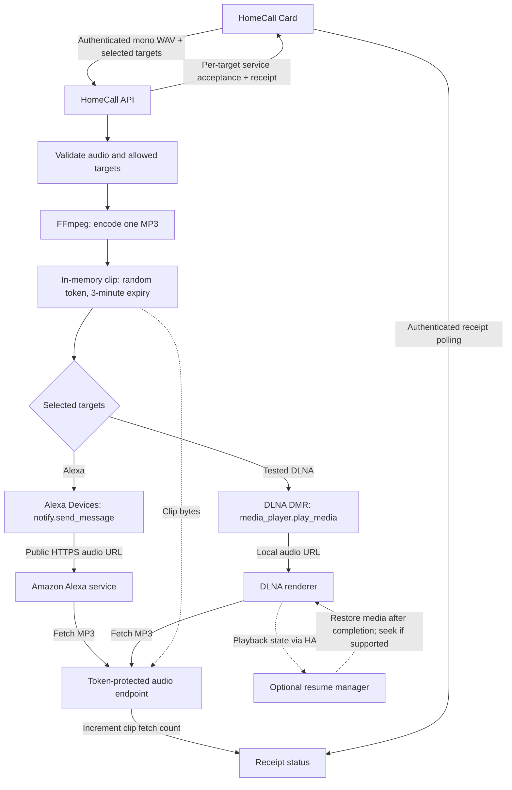

<p align="center"></p>

<p align="center">
<a href="https://github.com/thomasgregg/homecall/actions/workflows/ci.yml"></a>
<a href="LICENSE"></a>
<a href="https://hacs.xyz"></a>
</p>

**Record a message in Home Assistant. Hear your own voice on your speakers.**

HomeCall turns microphone recordings into short speaker announcements. It handles authenticated uploads, audio conversion, speakers shown in the card, and temporary delivery links. The separately installed [HomeCall Card](https://github.com/thomasgregg/homecall-card) provides the recording interface.

**HomeCall supports Alexa/Echo and compatible DLNA speakers.** Use Alexa through Home Assistant’s Alexa Devices integration, DLNA through DLNA Digital Media Renderer, or both together.

DLNA speakers must pass a sound test before they can appear in the card. JBL Charge 5 Wi-Fi has been checked for basic MP3 playback; other renderers require their own test. Optional **Resume music after announcements** can restore the interrupted media item and seek where supported. It does not restore playlists, queues, or streaming-service sessions. See [DLNA configuration and limitations](docs/configuration.md#dlna-speakers).

Ideas and contributions for other speaker platforms are welcome. [Open an issue](https://github.com/thomasgregg/homecall/issues) to discuss support.

## Contents

- [Why HomeCall](#why-homecall)
- [Before you start](#before-you-start)
- [Install](#install)
- [Use](#use)
- [How it works](#how-it-works)
- [Documentation](#documentation)
- [Development](#development)

## Why HomeCall

- **Original voice:** send recorded audio rather than synthesized speech.
- **One room or many:** announce to selected Alexa and tested DLNA speakers.
- **Native setup:** configure the public address and speakers shown in the card through Home Assistant.
- **Short-lived audio:** recordings are held in memory and delivery links expire after three minutes.
- **Clear feedback:** distinguish request acceptance from audio retrieval.
- **English and German:** setup and settings follow the Home Assistant language.

## Before you start

You need Home Assistant **2026.9 or newer** and FFmpeg with MP3 encoding. For Alexa, use the built-in [Alexa Devices integration](https://www.home-assistant.io/integrations/alexa_devices/) with working `notify.*_speak` entities. Amazon must be able to reach your Home Assistant instance over public HTTPS; Nabu Casa remote access or your own public HTTPS address can provide that connection. Open the recording dashboard through HTTPS and allow microphone access in your browser.

For DLNA, configure the built-in [DLNA Digital Media Renderer integration](https://www.home-assistant.io/integrations/dlna_dmr/) and ensure the speaker can reach HA’s local audio address. A public HTTPS address is not needed for DLNA delivery. The browser still needs HTTPS for microphone access.

HomeCall is a community project. It is not affiliated with Amazon or Home Assistant. Account, region, and Alexa service behavior can affect delivery; validate an announcement with your own devices before relying on it.

## Install

### HACS

[](https://my.home-assistant.io/redirect/hacs_repository/?owner=thomasgregg&repository=homecall&category=integration)

With HACS installed, click the button to open this custom repository in your Home Assistant instance. Add it when prompted, then choose **Download**. Install the integration and card separately.

1. In HACS, open **Custom repositories**.
2. Add `https://github.com/thomasgregg/homecall` as an **Integration**.
3. Download HomeCall and restart Home Assistant.
4. Open **Settings → Devices & services → Add integration → HomeCall**.
5. Choose **Alexa speakers** or **DLNA speakers**. For Alexa, configure the public HTTPS address and speaker selection. For DLNA, finish setup, then open **Configure → DLNA speakers → Available speakers**, press **Test** beside an online speaker, then confirm **Yes, add speaker** if you heard it.
6. Install [HomeCall Card](https://github.com/thomasgregg/homecall-card) separately.

### Manual

Copy [`custom_components/homecall`](custom_components/homecall) into `<config>/custom_components/homecall`, restart Home Assistant, and follow steps 4–6 above. Do not place the dashboard card inside the integration directory.

## Use

Add HomeCall Card to your dashboard. Tap the microphone to record. In HomeCall Card 1.1.0, the timer counts down from **1:00** and the recording ring fills clockwise. At **0:00**, recording stops and the outlined Send icon appears; nothing is sent automatically. Tap **Send** to announce to the selected speakers, or send earlier while recording. **Discard** stops recording and clears the local audio. Configure speakers shown in the card and the delivery address from the integration's settings page.

An accepted request means the target’s Home Assistant service call completed successfully. An audio-fetch receipt means a client fetched the temporary audio URL. Neither receipt proves a speaker audibly played the message.

## How it works




Alexa and DLNA use different delivery addresses for the same in-memory clip and expiring token. DLNA playback stays on the local network; Alexa delivery uses Amazon’s service. The card is installed separately and communicates only with HomeCall’s authenticated API. Music restoration depends on renderer capabilities and playback-state events; it is not guaranteed by a successful sound test.

## Documentation

| Guide                                      | Covers                                                            |
| ------------------------------------------ | ----------------------------------------------------------------- |
| [Configuration](docs/configuration.md)     | Public address, speakers shown in the card, and changing settings |
| [API and architecture](docs/api.md)        | Endpoints, limits, audio lifecycle, and module responsibilities   |
| [Troubleshooting](docs/troubleshooting.md) | Missing devices, microphone access, conversion, and delivery      |
| [Privacy and security](SECURITY.md)        | Authentication, audio access, retention, and reporting            |
| [Contributing](CONTRIBUTING.md)            | Development setup, test commands, and release checks              |
| [Changelog](CHANGELOG.md)                  | Public version history                                            |

## Development

```sh
python3.14 -m venv .venv
. .venv/bin/activate
pip install -r requirements-dev.txt
# Install ffmpeg and ffprobe with your operating system's package manager.
ruff check .
ruff format --check .
pytest --cov=custom_components.homecall --cov-report=term-missing
```

Tests import real Home Assistant modules and exercise WAV parsing, real FFmpeg conversion, HTTP handler behavior, settings permissions, device filtering, expiring tokens, and configuration flows. Service calls are mocked so tests do not contact Amazon or announce to real speakers. Audible Alexa/DLNA playback and DLNA music restoration remain hardware acceptance checks.

Licensed under [MIT](LICENSE). Built and maintained by [Thomas Gregg](https://github.com/thomasgregg).
