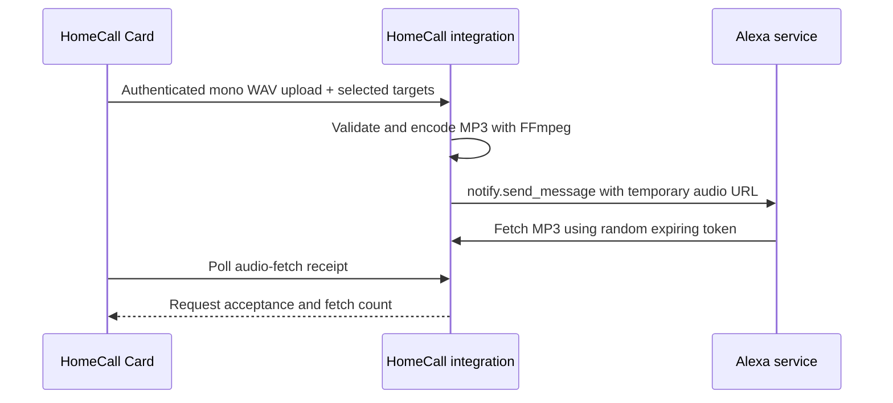

<p align="center"></p>

<p align="center">
<a href="https://github.com/thomasgregg/homecall/actions/workflows/ci.yml"></a>
<a href="LICENSE"></a>
<a href="https://hacs.xyz"></a>
</p>

**Record a message in Home Assistant. Hear your own voice on your Echo speakers.**

HomeCall turns microphone recordings into short Alexa announcements. It handles authenticated uploads, audio conversion, allowed devices, and temporary delivery links. The separately installed [HomeCall Card](https://github.com/thomasgregg/homecall-card) provides the recording interface.

## Why HomeCall

- **Original voice:** send recorded audio rather than synthesized speech.
- **One room or many:** announce to selected Echo devices, with an administrator-controlled allowlist.
- **Native setup:** configure the public address and allowed devices through Home Assistant.
- **Short-lived audio:** recordings are held in memory and delivery links expire after three minutes.
- **Clear feedback:** distinguish Alexa accepting a request from Alexa fetching the audio.
- **English and German:** setup and settings follow the Home Assistant language.

## Before you start

You need Home Assistant **2026.9 or newer**, the built-in [Alexa Devices integration](https://www.home-assistant.io/integrations/alexa_devices/) with working `notify.*_speak` entities, and FFmpeg with MP3 encoding available to Home Assistant. Amazon must be able to reach your Home Assistant instance over public HTTPS; Nabu Casa remote access or your own public HTTPS address can provide that connection. Open the recording dashboard through HTTPS and allow microphone access in your browser.

HomeCall is a community project. It is not affiliated with Amazon or Home Assistant. Account, region, and Alexa service behavior can affect delivery; validate an announcement with your own devices before relying on it.

## Install

### HACS

1. In HACS, open **Custom repositories**.
2. Add `https://github.com/thomasgregg/homecall` as an **Integration**.
3. Download HomeCall and restart Home Assistant.
4. Open **Settings → Devices & services → Add integration → HomeCall**.
5. Choose the detected Home Assistant address or enter your public HTTPS origin, then allow all devices or select specific devices.
6. Install [HomeCall Card](https://github.com/thomasgregg/homecall-card) separately.

### Manual

Copy [`custom_components/homecall`](custom_components/homecall) into `<config>/custom_components/homecall`, restart Home Assistant, and follow steps 4–6 above. Do not place the dashboard card inside the integration directory.

## Use

Add HomeCall Card to your dashboard. Tap the microphone, speak for up to 60 seconds, and tap **Send** to announce to the selected speakers. **Discard** stops recording and clears the local audio. Configure allowed devices and the delivery address from the integration's settings page.

An accepted request means Alexa accepted the announcement instruction. An audio-fetch receipt means a client fetched the temporary audio URL. Neither receipt proves a speaker audibly played the message.

## How it works



## Documentation

| Guide                                      | Covers                                                          |
| ------------------------------------------ | --------------------------------------------------------------- |
| [Configuration](docs/configuration.md)     | Public address, allowed devices, and changing settings          |
| [API and architecture](docs/api.md)        | Endpoints, limits, audio lifecycle, and module responsibilities |
| [Troubleshooting](docs/troubleshooting.md) | Missing devices, microphone access, conversion, and delivery    |
| [Privacy and security](SECURITY.md)        | Authentication, audio access, retention, and reporting          |
| [Contributing](CONTRIBUTING.md)            | Development setup, test commands, and release checks            |
| [Changelog](CHANGELOG.md)                  | Public version history                                          |

## Development

```sh
python3.14 -m venv .venv
. .venv/bin/activate
pip install -r requirements-dev.txt
# Install ffmpeg and ffprobe with your operating system's package manager.
ruff check .
ruff format --check .
pytest --cov=custom_components.homecall --cov-report=term-missing
```

Tests import real Home Assistant modules and exercise WAV parsing, real FFmpeg conversion, HTTP handler behavior, settings permissions, device filtering, expiring tokens, and configuration flows. Service calls are mocked so tests do not contact Amazon or announce to real speakers. End-to-end Alexa playback remains a hardware acceptance check.

Licensed under [MIT](LICENSE). Built and maintained by [Thomas Gregg](https://github.com/thomasgregg).
