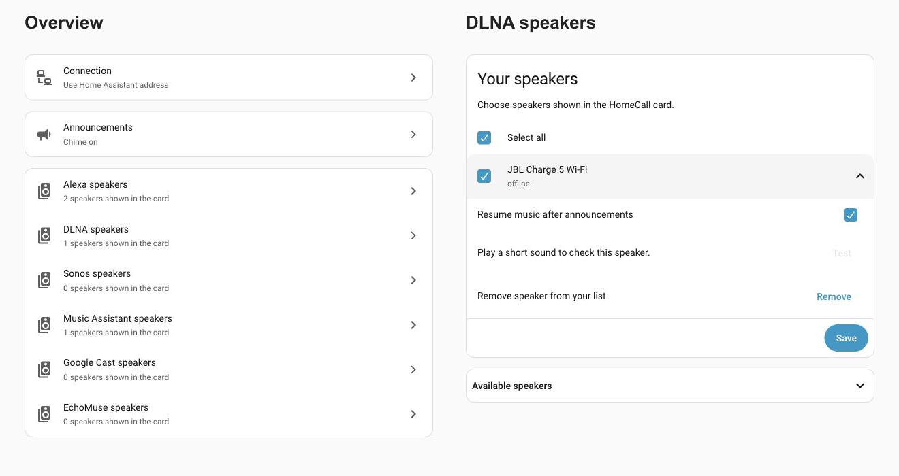
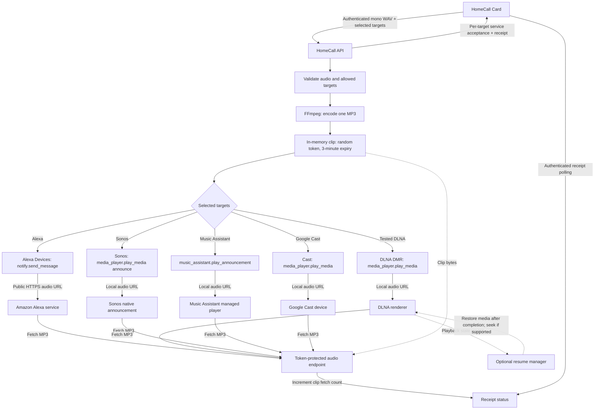

<p align="center">
<a href="https://github.com/thomasgregg/homecall/actions/workflows/ci.yml"></a>
<a href="LICENSE"></a>
<a href="https://hacs.xyz"></a>
</p>

**Record a message in Home Assistant. Hear your own voice on your speakers.**

HomeCall turns microphone recordings into short speaker announcements. It handles authenticated uploads, audio conversion, speakers shown in the card, and temporary delivery links. The separately installed [HomeCall Card](https://github.com/thomasgregg/homecall-card) provides the recording interface.

## Contents

- [Why HomeCall](#why-homecall)
- [Screenshots](#screenshots)
- [Speaker compatibility](#speaker-compatibility)
- [Which setup should I use?](#which-setup-should-i-use)
- [Before you start](#before-you-start)
- [Google Cast / Nest setup](#google-cast--nest-setup)
  - [Cast music continuation: possible routes](#cast-music-continuation-possible-routes)
- [Install](#install)
  - [HACS](#hacs)
  - [Manual installation](#manual)
- [Use](#use)
- [How it works](#how-it-works)
- [Documentation](#documentation)
- [Development](#development)

## Why HomeCall

- **Original voice:** send recorded audio rather than synthesized speech.
- **One room or many:** announce to selected Alexa, DLNA, Sonos, Music Assistant or Google Cast speakers.
- **Native setup:** configure the public address and speakers shown in the card through Home Assistant.
- **Short-lived audio:** recordings are held in memory and delivery links expire after three minutes.
- **Clear feedback:** distinguish request acceptance from audio retrieval.
- **English and German:** setup and settings follow the Home Assistant language.

## Screenshots

HomeCall’s configuration screens in a real Home Assistant installation: connection overview, Alexa speaker selection, and DLNA speaker options.



View the full-size screens: [overview](docs/assets/ui-overview.png), [Alexa speakers](docs/assets/ui-alexa.png), and [DLNA speakers](docs/assets/ui-dlna.png).

The separately installed [HomeCall Card](https://github.com/thomasgregg/homecall-card#screenshots) provides the recording interface, with a live waveform, countdown, and speaker picker.

[](https://github.com/thomasgregg/homecall-card#screenshots)

## Speaker compatibility

**HomeCall supports Alexa/Echo, compatible DLNA speakers, Music Assistant players, Google Cast devices, and Sonos through Home Assistant’s Sonos integration.** Use Alexa through Home Assistant’s Alexa Devices integration, DLNA through DLNA Digital Media Renderer, Sonos through the Sonos integration, and Music Assistant players through the Music Assistant integration. You can combine these platforms.

DLNA speakers must pass a sound test before they can appear in the card. JBL Charge 5 Wi-Fi has been checked for basic MP3 playback; other renderers require their own test. Optional **Resume music after announcements** can restore the interrupted media item and seek where supported. It does not restore playlists, queues, or streaming-service sessions. See [DLNA configuration and limitations](docs/configuration.md#dlna-speakers).

Ideas and contributions for other speaker platforms are welcome. [Open an issue](https://github.com/thomasgregg/homecall/issues) to discuss support.

🟢 **Verified** on the noted setup · 🟠 **Unverified or conditional** · 🔴 **Unsupported or failed**

| Protocol / integration | Announcement playback | Music continuation | Tested hardware / scope |
| --- | --- | --- | --- |
| Alexa Devices | 🟢 Recorded voice announcements verified. | 🟢 TuneIn radio resumed after Alexa SSML soundbank clips. | Echo Show with Deutschlandfunk/TuneIn and soundbank clips. HomeCall-recording resume and other sources/models untested. |
| DLNA | 🟢 MP3 playback verified. | 🟠 Optional current-item restoration and seek where supported; hardware restoration unverified. No playlist/session restoration. | JBL Charge 5 Wi-Fi; other renderers require the sound test. |
| Sonos | 🟠 Implemented using native `announce: true`; hardware playback unverified. | 🟠 Delegated to Sonos; not hardware-verified. | Simulated discovery, setup and service-call tests only. |
| Music Assistant → AirPlay 2 | 🟢 HomeCall MP3 test chime verified. | 🟢 With MA-managed music: ducking, continuation and volume restoration verified. | JBL Charge 5 Wi-Fi, MA 2.10.5. Ducking verified; full pause/resume untested. |
| Music Assistant → Google Cast / other providers | 🟠 Uses MA’s announcement service; these transports remain unverified with HomeCall. | 🟠 MA documents restoration of its own music; verify per provider/device. | AirPlay results do not establish Cast, DLNA, Sonos or group behavior. |
| Direct Google Cast | 🟢 HomeCall MP3 test chime verified. | 🔴 No automatic restoration. Phone-started YouTube Music remained stopped in our test. | JBL Charge 5 Wi-Fi; Nest Mini, Nest Hub and groups still need hardware tests. |

Results apply to the tested setup, not every model or firmware version. The DLNA, MA and Cast hardware checks used generated MP3s; microphone recordings through these routes still need separate verification. DLNA requires a downloaded sound test and audible confirmation before adding a speaker. The other integrations offer optional sound tests.

<details>
<summary>Additional Cast test findings</summary>

- Direct Cast produced no audible chime while Google Cast was disabled in JBL One. Enabling it resolved announcement playback.
- With iPhone YouTube Music confirmed playing through Cast, HomeCall’s chime was audible but music stayed stopped. HA reported the Cast entity off afterward.
- Reopening YouTube Music’s receiver and sending Play left it idle without the previous track. The receiver-launch service also returned an error; this did not establish a working recovery method.
- The Onkyo TX-NR696 was discovered but offline, so it has no playback result.
- MA over Cast, Nest devices, groups and microphone recordings through direct Cast remain untested on hardware.

</details>

The Alexa resume test used soundbank audio through the same Speak/SSML mechanism as HomeCall, with audible confirmation that the station resumed automatically. It did not test restoration after a HomeCall-hosted recorded MP3.

## Which setup should I use?

| Use case | Recommended route | What to expect |
| --- | --- | --- |
| Streaming music or playlists should continue after messages | **Music Assistant**, with music started through MA and announcements sent to its MA entity. | MA owns the queue and handles announcements. Our AirPlay 2 test passed; test your chosen provider. MA supports many [music services](https://www.music-assistant.io/music-providers/), subject to provider and account requirements. |
| Occasional messages on Nest or another Cast speaker, with music interruption acceptable | **Direct Google Cast**. | Simple local MP3 delivery, no MA server required. Current playback is replaced and does not automatically return. Nest hardware still needs testing. |
| Keep casting YouTube Music directly from a phone and preserve its session | 🔴 No verified HomeCall route for an audio-only Cast speaker. For dependable queue control, start music through **MA** instead. | Direct Cast interrupted our phone session; reopening the receiver did not restore it. |
| Existing Echo speakers | **Alexa Devices**. | Recorded voice playback is verified; Amazon must reach the public HTTPS audio URL. TuneIn radio resumed in the Echo Show soundbank test; recorded-MP3 restoration and other sources still need verification. |
| Existing Sonos system without MA | **Direct Sonos**. | Uses Sonos’s native announcement support; audible playback and restoration still need a hardware test. If MA manages the music, use the MA entity. |
| Basic local audio renderer without MA | **DLNA**. | Validate with the sound test. Optional resume handles a reusable current item where supported, rather than streaming-service sessions or full queues. |

Choose one HomeCall target per physical speaker. When MA manages the music, use its entity and hide the corresponding direct Cast/DLNA/Sonos entry from the card to avoid duplicate announcements. For MA groups, consult its [announcement group behavior](https://www.music-assistant.io/integration/announcements/#group-behaviour).

## Before you start

You need Home Assistant **2026.9 or newer** and FFmpeg with MP3 encoding. For Alexa, use the built-in [Alexa Devices integration](https://www.home-assistant.io/integrations/alexa_devices/) with working `notify.*_speak` entities. Amazon must be able to reach your Home Assistant instance over public HTTPS; Nabu Casa remote access or your own public HTTPS address can provide that connection. Open the recording dashboard through HTTPS and allow microphone access in your browser.

For DLNA, configure the built-in [DLNA Digital Media Renderer integration](https://www.home-assistant.io/integrations/dlna_dmr/) and ensure the speaker can reach HA’s local audio address. A public HTTPS address is not needed for DLNA delivery. The browser still needs HTTPS for microphone access.

For Sonos, configure Home Assistant’s [Sonos integration](https://www.home-assistant.io/integrations/sonos/), then choose speakers under **Sonos speakers**. A sound test is available in each speaker row and is optional. HomeCall uses `announce: true` and leaves music restoration to Sonos. Simulated discovery, onboarding, and delivery tests pass; physical Sonos playback has not yet been verified. Older hardware and S1 firmware may have announcement limitations.

For Music Assistant, install and start the [Music Assistant server](https://www.music-assistant.io/), connect your speakers, and configure its [Home Assistant integration](https://www.home-assistant.io/integrations/music_assistant/), then open **HomeCall → Configure → Music Assistant speakers**, add players, select visibility, and save. HomeCall sends recorded MP3s through `music_assistant.play_announcement`; Music Assistant handles playback restoration. Choose the MA entity rather than the underlying DLNA/Sonos entity when music is managed by MA. The JBL Charge 5 Wi-Fi / AirPlay 2 test confirmed audible chime playback, music ducking and volume restoration. Playback behavior depends on the player and protocol; see [Music Assistant configuration and tested scope](docs/configuration.md#music-assistant-announcements).

HomeCall is a community project. It is not affiliated with Amazon or Home Assistant. Account, region, and Alexa service behavior can affect delivery; validate an announcement with your own devices before relying on it.

## Google Cast / Nest setup

Configure Home Assistant’s [Google Cast integration](https://www.home-assistant.io/integrations/cast/), then open **HomeCall → Configure → Google Cast speakers**. Add your Nest Mini, Nest Hub or other Cast device, choose whether it appears in the card, and save. Expand the added device to play the optional sound test.

HomeCall sends the recorded MP3 directly through `media_player.play_media`. The Cast device must be able to reach Home Assistant’s local audio URL. If necessary, set **Connection → Local address** to a LAN IP address and port, for example `http://192.168.1.2:8123`. Cast devices can have trouble resolving `.local` names; HTTPS must have a certificate the device trusts. The browser still needs HTTPS for microphone recording.

Direct Cast playback interrupts existing media and does not restore it automatically. A JBL Charge 5 Wi-Fi played HomeCall’s test chime after Google Cast was enabled in JBL One. A second test interrupted iPhone-started YouTube Music: the chime was audible, but music remained stopped. Reopening the YouTube Music receiver and sending Play did not recover the track. A Nest Hub may replace its current screen while receiving media. Service acceptance and an audio download do not prove audible playback. Nest hardware, microphone recordings through Cast and Cast groups have not yet been verified.

### Cast music continuation: possible routes

These are possible recovery routes, not additional passing hardware tests:

| Route | Feasibility / next check |
| --- | --- |
| Music Assistant owns the music queue and uses its Google Cast provider | **Best next hardware test.** MA documents both [Google Cast support](https://www.music-assistant.io/player-support/google-cast/) and [restoration of MA-managed music after announcements](https://www.music-assistant.io/integration/announcements/). Start a track using MA over Cast, send HomeCall through the MA entity, and verify the track, position, volume and next queue item. The successful AirPlay test does not verify this route. |
| Direct Cast playing a reusable HTTP audio URL or radio stream | **Plausible HomeCall enhancement, not implemented or tested.** Snapshot the URL, type, position and volume before the announcement, then reload it afterward; buffered audio could resume at its saved position and live radio would reconnect. HA documents Cast URL playback and `extra.current_time` in [play_media](https://www.home-assistant.io/actions/media_player.play_media/). This would restore an item, not an arbitrary phone app’s session or playlist. |
| Phone-started YouTube Music on an audio-only Cast speaker | **No working generic recovery found.** [Google Home Resume](https://github.com/TheFes/Google-Home-Resume#youtube-music-resume) requires music started by the custom Ytube Music Player integration for its music-player recovery path. Its [known limitations](https://github.com/TheFes/Google-Home-Resume#known-limitations) restrict ordinary YouTube/YouTube Music recovery to the current item on devices with a screen. Our JBL receiver-relaunch experiment also failed. |
| Add `announce: true` or enqueue to direct Cast delivery | **Not an established fix.** [HA’s play_media documentation](https://www.home-assistant.io/actions/media_player.play_media/) requires announcement support in the player implementation. [PyChromecast’s media controller](https://github.com/home-assistant-libs/pychromecast/blob/master/pychromecast/controllers/media.py) starts the default receiver for generic media, so enqueue alone does not demonstrate preservation of a YouTube Music receiver’s session. |

When testing the MA route, select the MA entity for announcements and avoid selecting both it and the underlying Cast entity for the same physical device. Music must be managed by MA for the documented restoration path. Group announcement behavior has separate limitations described in the MA documentation.

## Install

### HACS

[](https://my.home-assistant.io/redirect/hacs_repository/?owner=thomasgregg&repository=homecall&category=integration)

With HACS installed, click the button to open this custom repository in your Home Assistant instance. Add it when prompted, then choose **Download**. Install the integration and card separately.

1. In HACS, open **Custom repositories**.
2. Add `https://github.com/thomasgregg/homecall` as an **Integration**.
3. Download HomeCall and restart Home Assistant.
4. Open **Settings → Devices & services → Add integration → HomeCall**.
5. Choose **Alexa speakers**, **DLNA speakers**, **Sonos speakers** or **Music Assistant speakers** or **Google Cast speakers**. For Alexa, configure the public HTTPS address and speaker selection. For DLNA, finish setup, then open **Configure → DLNA speakers → Available speakers**, press **Test** beside an online speaker, then confirm **Yes, add speaker** if you heard it.
6. Install [HomeCall Card](https://github.com/thomasgregg/homecall-card) separately.

### Manual

Copy [`custom_components/homecall`](custom_components/homecall) into `<config>/custom_components/homecall`, restart Home Assistant, and follow steps 4–6 above. Do not place the dashboard card inside the integration directory.

## Use

Add HomeCall Card to your dashboard. Tap the microphone to record. In HomeCall Card 1.1.0, the timer counts down from **1:00** and the recording ring fills clockwise. At **0:00**, recording stops and the outlined Send icon appears; nothing is sent automatically. Tap **Send** to announce to the selected speakers, or send earlier while recording. **Discard** stops recording and clears the local audio. Configure speakers shown in the card and the delivery address from the integration's settings page.

An accepted request means the target’s Home Assistant service call completed successfully. An audio-fetch receipt means a client fetched the temporary audio URL. Neither receipt proves a speaker audibly played the message.

## How it works



Alexa uses the public HTTPS delivery address; DLNA, Sonos, Music Assistant and Google Cast use the local address for the same in-memory clip and expiring token. Sonos and Music Assistant manage their announcement playback and restoration; HomeCall offers its own optional restoration only for DLNA. The card is installed separately and communicates only with HomeCall’s authenticated API. Music restoration depends on renderer capabilities and playback-state events; it is not guaranteed by a successful sound test.

## Documentation

| Guide                                      | Covers                                                            |
| ------------------------------------------ | ----------------------------------------------------------------- |
| [Configuration](docs/configuration.md)     | Public address, speakers shown in the card, and changing settings |
| [API and architecture](docs/api.md)        | Endpoints, limits, audio lifecycle, and module responsibilities   |
| [Troubleshooting](docs/troubleshooting.md) | Missing devices, microphone access, conversion, and delivery      |
| [Privacy and security](SECURITY.md)        | Authentication, audio access, retention, and reporting            |
| [Contributing](CONTRIBUTING.md)            | Development setup, test commands, and release checks              |
| [Changelog](CHANGELOG.md)                  | Public version history                                            |

## Development

```sh
python3.14 -m venv .venv
. .venv/bin/activate
pip install -r requirements-dev.txt
# Install ffmpeg and ffprobe with your operating system's package manager.
ruff check .
ruff format --check .
pytest --cov=custom_components.homecall --cov-report=term-missing
```

Tests import real Home Assistant modules and exercise WAV parsing, real FFmpeg conversion, HTTP handler behavior, settings permissions, device filtering, expiring tokens, and configuration flows. Service calls are mocked so tests do not contact Amazon or announce to real speakers. Audible Alexa/DLNA playback and DLNA music restoration remain hardware acceptance checks.

Licensed under [MIT](LICENSE). Built and maintained by [Thomas Gregg](https://github.com/thomasgregg).
