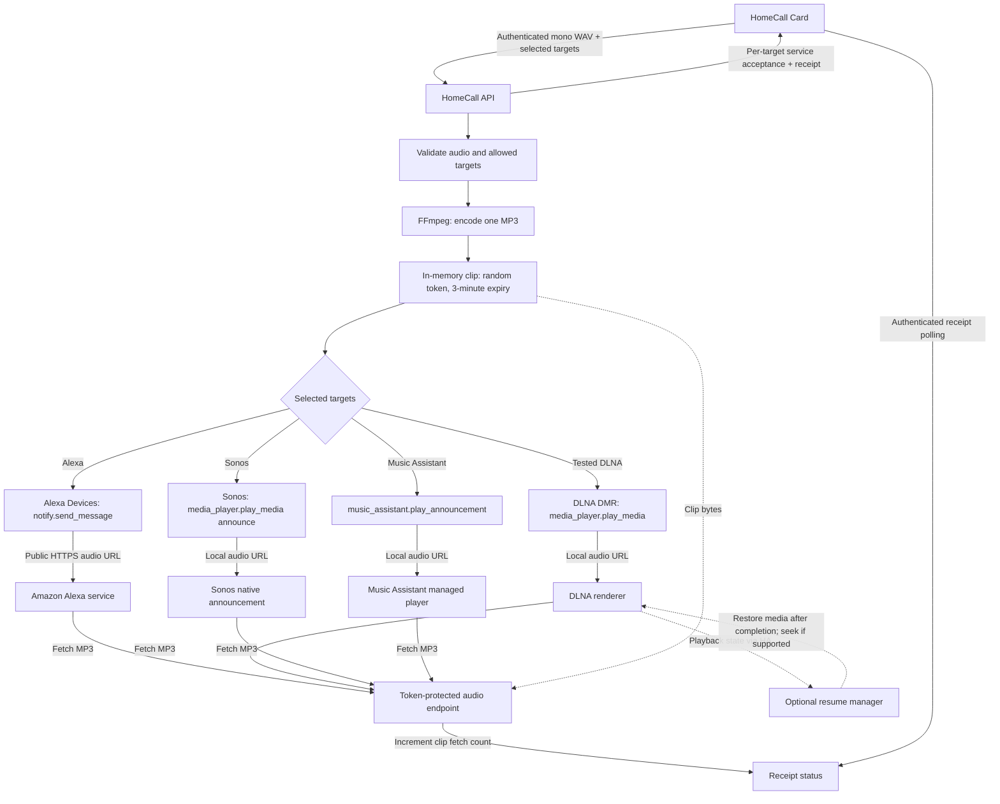

<p align="center">
<a href="https://github.com/thomasgregg/homecall/actions/workflows/ci.yml"></a>
<a href="LICENSE"></a>
<a href="https://hacs.xyz"></a>
</p>

**Record a message in Home Assistant. Hear your own voice on your speakers.**

HomeCall turns microphone recordings into short speaker announcements. It handles authenticated uploads, audio conversion, speakers shown in the card, and temporary delivery links. The separately installed [HomeCall Card](https://github.com/thomasgregg/homecall-card) provides the recording interface.

**HomeCall supports Alexa/Echo, compatible DLNA speakers, Music Assistant players, and Sonos through Home Assistant’s Sonos integration.** Use Alexa through Home Assistant’s Alexa Devices integration, DLNA through DLNA Digital Media Renderer, Sonos through the Sonos integration, and Music Assistant players through the Music Assistant integration. You can combine these platforms.

DLNA speakers must pass a sound test before they can appear in the card. JBL Charge 5 Wi-Fi has been checked for basic MP3 playback; other renderers require their own test. Optional **Resume music after announcements** can restore the interrupted media item and seek where supported. It does not restore playlists, queues, or streaming-service sessions. See [DLNA configuration and limitations](docs/configuration.md#dlna-speakers).

Ideas and contributions for other speaker platforms are welcome. [Open an issue](https://github.com/thomasgregg/homecall/issues) to discuss support.

## Contents

- [Speaker compatibility](#speaker-compatibility)
- [Why HomeCall](#why-homecall)
- [Screenshots](#screenshots)
- [Before you start](#before-you-start)
- [Install](#install)
- [Use](#use)
- [How it works](#how-it-works)
- [Documentation](#documentation)
- [Development](#development)

## Speaker compatibility

| Platform | Status | Tested device / scope |
| --- | --- | --- |
| Alexa / Echo | Tested — works | Recorded announcements through Home Assistant’s Alexa Devices integration. |
| DLNA | Tested — basic playback works | JBL Charge 5 Wi-Fi: audible HomeCall-format MP3 playback confirmed. Other DLNA devices require their own sound test; music restoration is not hardware-verified. |
| Music Assistant | Tested — announcement and music ducking | JBL Charge 5 Wi-Fi through Music Assistant 2.10.5 / AirPlay 2: HomeCall test chime was audible while music lowered, then returned to its previous volume. Full pause/resume and other player protocols are not hardware-verified. |
| Sonos | Integrated — needs device testing | Discovery, onboarding and announcement service calls verified with simulated entities. Audible playback, music ducking and restoration still need a real Sonos speaker test. |

These results apply to the tested setup, not every model or firmware version. DLNA speakers must pass the in-app sound test before appearing in the card. Alexa, Sonos and Music Assistant offer optional sound tests and list discovered speakers directly.

## Why HomeCall

- **Original voice:** send recorded audio rather than synthesized speech.
- **One room or many:** announce to selected Alexa, DLNA, Sonos or Music Assistant speakers.
- **Native setup:** configure the public address and speakers shown in the card through Home Assistant.
- **Short-lived audio:** recordings are held in memory and delivery links expire after three minutes.
- **Clear feedback:** distinguish request acceptance from audio retrieval.
- **English and German:** setup and settings follow the Home Assistant language.

## Screenshots

HomeCall’s configuration screens in a real Home Assistant installation: connection overview, Alexa speaker selection, and DLNA speaker options.


View the full-size screens: [overview](docs/assets/ui-overview.png), [Alexa speakers](docs/assets/ui-alexa.png), and [DLNA speakers](docs/assets/ui-dlna.png).

The separately installed [HomeCall Card](https://github.com/thomasgregg/homecall-card#screenshots) provides the recording interface, with a live waveform, countdown, and speaker picker.

[](https://github.com/thomasgregg/homecall-card#screenshots)

## Before you start

You need Home Assistant **2026.9 or newer** and FFmpeg with MP3 encoding. For Alexa, use the built-in [Alexa Devices integration](https://www.home-assistant.io/integrations/alexa_devices/) with working `notify.*_speak` entities. Amazon must be able to reach your Home Assistant instance over public HTTPS; Nabu Casa remote access or your own public HTTPS address can provide that connection. Open the recording dashboard through HTTPS and allow microphone access in your browser.

For DLNA, configure the built-in [DLNA Digital Media Renderer integration](https://www.home-assistant.io/integrations/dlna_dmr/) and ensure the speaker can reach HA’s local audio address. A public HTTPS address is not needed for DLNA delivery. The browser still needs HTTPS for microphone access.

For Sonos, configure Home Assistant’s [Sonos integration](https://www.home-assistant.io/integrations/sonos/), then choose speakers under **Sonos speakers**. A sound test is available in each speaker row and is optional. HomeCall uses `announce: true` and leaves music restoration to Sonos. Simulated discovery, onboarding, and delivery tests pass; physical Sonos playback has not yet been verified. Older hardware and S1 firmware may have announcement limitations.

For Music Assistant, install and start the [Music Assistant server](https://www.music-assistant.io/), connect your speakers, and configure its [Home Assistant integration](https://www.home-assistant.io/integrations/music_assistant/), then open **HomeCall → Configure → Music Assistant speakers**, add players, select visibility, and save. HomeCall sends recorded MP3s through `music_assistant.play_announcement`; Music Assistant handles playback restoration. Choose the MA entity rather than the underlying DLNA/Sonos entity when music is managed by MA. The JBL Charge 5 Wi-Fi / AirPlay 2 test confirmed audible chime playback, music ducking and volume restoration. Playback behavior depends on the player and protocol; see [Music Assistant configuration and tested scope](docs/configuration.md#music-assistant-announcements).

HomeCall is a community project. It is not affiliated with Amazon or Home Assistant. Account, region, and Alexa service behavior can affect delivery; validate an announcement with your own devices before relying on it.

## Install

### HACS

[](https://my.home-assistant.io/redirect/hacs_repository/?owner=thomasgregg&repository=homecall&category=integration)

With HACS installed, click the button to open this custom repository in your Home Assistant instance. Add it when prompted, then choose **Download**. Install the integration and card separately.

1. In HACS, open **Custom repositories**.
2. Add `https://github.com/thomasgregg/homecall` as an **Integration**.
3. Download HomeCall and restart Home Assistant.
4. Open **Settings → Devices & services → Add integration → HomeCall**.
5. Choose **Alexa speakers**, **DLNA speakers**, **Sonos speakers** or **Music Assistant speakers**. For Alexa, configure the public HTTPS address and speaker selection. For DLNA, finish setup, then open **Configure → DLNA speakers → Available speakers**, press **Test** beside an online speaker, then confirm **Yes, add speaker** if you heard it.
6. Install [HomeCall Card](https://github.com/thomasgregg/homecall-card) separately.

### Manual

Copy [`custom_components/homecall`](custom_components/homecall) into `<config>/custom_components/homecall`, restart Home Assistant, and follow steps 4–6 above. Do not place the dashboard card inside the integration directory.

## Use

Add HomeCall Card to your dashboard. Tap the microphone to record. In HomeCall Card 1.1.0, the timer counts down from **1:00** and the recording ring fills clockwise. At **0:00**, recording stops and the outlined Send icon appears; nothing is sent automatically. Tap **Send** to announce to the selected speakers, or send earlier while recording. **Discard** stops recording and clears the local audio. Configure speakers shown in the card and the delivery address from the integration's settings page.

An accepted request means the target’s Home Assistant service call completed successfully. An audio-fetch receipt means a client fetched the temporary audio URL. Neither receipt proves a speaker audibly played the message.

## How it works



Alexa uses the public HTTPS delivery address; DLNA, Sonos and Music Assistant use the local address for the same in-memory clip and expiring token. Sonos and Music Assistant manage their announcement playback and restoration; HomeCall offers its own optional restoration only for DLNA. The card is installed separately and communicates only with HomeCall’s authenticated API. Music restoration depends on renderer capabilities and playback-state events; it is not guaranteed by a successful sound test.

## Documentation

| Guide                                      | Covers                                                            |
| ------------------------------------------ | ----------------------------------------------------------------- |
| [Configuration](docs/configuration.md)     | Public address, speakers shown in the card, and changing settings |
| [API and architecture](docs/api.md)        | Endpoints, limits, audio lifecycle, and module responsibilities   |
| [Troubleshooting](docs/troubleshooting.md) | Missing devices, microphone access, conversion, and delivery      |
| [Privacy and security](SECURITY.md)        | Authentication, audio access, retention, and reporting            |
| [Contributing](CONTRIBUTING.md)            | Development setup, test commands, and release checks              |
| [Changelog](CHANGELOG.md)                  | Public version history                                            |

## Development

```sh
python3.14 -m venv .venv
. .venv/bin/activate
pip install -r requirements-dev.txt
# Install ffmpeg and ffprobe with your operating system's package manager.
ruff check .
ruff format --check .
pytest --cov=custom_components.homecall --cov-report=term-missing
```

Tests import real Home Assistant modules and exercise WAV parsing, real FFmpeg conversion, HTTP handler behavior, settings permissions, device filtering, expiring tokens, and configuration flows. Service calls are mocked so tests do not contact Amazon or announce to real speakers. Audible Alexa/DLNA playback and DLNA music restoration remain hardware acceptance checks.

Licensed under [MIT](LICENSE). Built and maintained by [Thomas Gregg](https://github.com/thomasgregg).
